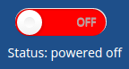
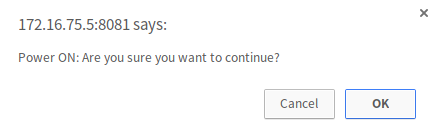
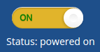

# Powering on and off the T.rex exhibition

In this manual the alternative procedures for powering on and off the T.rex exhibition are explained. In order to pevent hardware failure, it is important to follow these instructions.

There are multiple methods to power on and off the (computers in) the exhibition, all of which are explained in detail below. All methods except one make use of a central on/off controller unit.

## Touch screen

There's a touch screen interface provided behind the top panel at the back of the T.rex Gym exhibit. You can open the panel with a hex key, size xx

### Powering on

1. Make sure the power is turned on. The panel PC is configured to automatically start after AC is restored. Approximately two minutes after power is restored the touch interface will appear.

2. The first time after power restore a login screen will appear. The login credentials are supplied already. Login by clicking on the 'Login' button.
   N.B. If you accidentally hit the 'Reset' button, the credentials should reappear.

3. After you've succesfully logged in, you'll see a toggle switch which shows the current status and with which you can power on the exhibition. Tap on the right side of the button to power on the exhibition:

   

4. A popup will appear that asks you to confirm that the exhibition should be powered on. Tap `OK` to confirm, and tap `Cancel` to abort:

   

5. After you've confirmed, the toggle switch will turn gray and won't respond to input while the exhibition is powering on. After two minutes, when the exhibition is powered on, the switch will turn yellow and respond to input again.

N.B. The exhibit computers are configured to automatically start when the power is restored.

### Powering off

1. The toggle switch should be yellow, indicating that the exhibition is currently powered on. Tap the button on the left to power off the exhibition:

   

2. A popup will appear that asks you to confirm that the exhibition should indeed be powered off. Tap `OK` to confirm, and tap `Cancel` to abort.

3. After you've confirmed, the toggle switch will turn gray and won't respond to input while the exhibition is powering on. After two minutes, when the exhibition is powered on, the switch will turn yellow and respond to input again.

4. Depending on the configuration the panel PC itself will shutdown as well. After that the power can be turned off for the entire exhibition.

## Remote web interface

The touch screen can be used from a remote computer on the LAN as well. This option depends on the local network configuration. Ask your IT department / technical support for the IP address of the control unit and the required network access.

1. Open a web browser

2. Go to: `http://<IP address control unit>:8080/stargazer-web`.

3. Bookmark the page for convenience: `Ctrl` + `D`

3. Login with the credentials that are supplied separately

4. Follow the instructions as explained in [the section about the touch interface](## Touch interface)


## Show controller

Apart from the user interface the exhibition can be powered on and off by another machine (i.e. a show controller) as well. The controller has a simple REST API.

### Get the current status of the exhibition

1. Send a HTTP GET request to the control unit, for example with `curl`:

   `curl -i http://<IP address control unit>:5000/v0/collections/trex-in-town/status`

2. You'll receive a reply in JSON format:

   ```json
   {
     "detail": {
       "collection": "trex-in-town",
       "collectionstatus": "POWEREDON"
     },
     "status": 200,
     "title": "Collection status."
   }
   ```

### Get the current status of an individual exhibit

1. Send a HTTP GET request to the control unit, for example with `curl`:

   `curl -i http://<IP address control unit>:5000/v0/devices/interactive-gym-001/status`

2. Again, you'll receive a reply in JSON format:

   ```json
   {
     "detail": {
       "collection": "interactive-gym-001",
       "collectionstatus": "POWEREDOFF"
     },
     "status": 200,
     "title": "Collection status."
   }
   ```

### Powering on

1. Make sure the power in the exhibition space is turned on. The panel PC is configured to automatically start after AC is restored. Approximately two minutes after AC is restored the touch interface will appear.

2. Send a HTTP POST request to the control unit, for example with `curl`, to power on the exhibition:

   ```bash
   curl -i -H "Content-Type: application/json" -X POST -d '{"powerOn":{}}' http://<IP address control unit>:8080/v0/collections/trex-in-town/action
   ```

3. After two minutes the exhibition is powered on.


### Powering off

1. Send a HTTP POST request to the control unit, for example with `curl`, to power off the exhibition:

   ```bash
   curl -i -H "Content-Type: application/json" -X POST -d '{"powerOff":{}}' http://<IP address control unit>:8080/v0/collections/trex-in-town/action
   ```

2. After two minutes the exhibition is powered off. It is now safe to power off the entire exhibition space.

## Manually

In case there is an issue with the controller PC it is possible to power on and off all exhibits manually by just pushing the power button of each computer.

N.B. The status of the exhibition that is reported by the controller PC might be incorrect after manually powering on and off individual exhibits. In case the controller unit reports that the exhibition is powered off, while the / some exhibits are powered on, you get the controller back in sync by sending a power on command and after that a power off command and vice versa.
